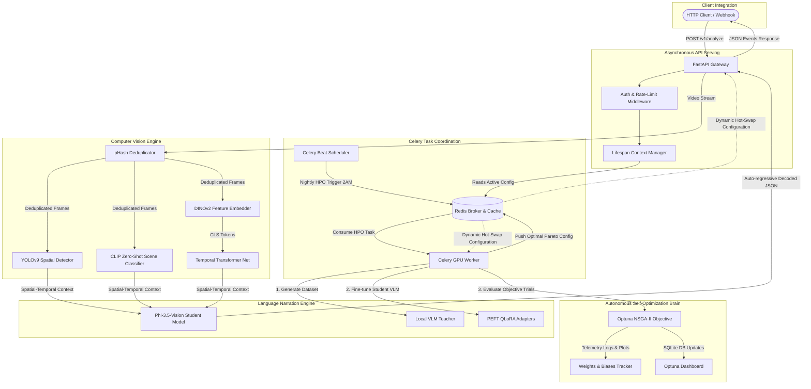

# SignalSense AI: Self-Improving Video Understanding System

SignalSense AI is a production-grade, distributed computer vision (CV) and natural language processing (NLP) system designed for real-time video understanding, spatial-temporal object tracking, semantic anomaly detection, and automated text narration. 

The core architectural innovation of SignalSense AI is its autonomous self-improving hyperparameter optimization (HPO) feedback loop. Backed by a high-performance Redis cache and a Celery queue, the system schedules nightly hyperparameter optimization studies, maps out the Pareto frontier between detection accuracy and execution latency, and hot-swaps active ML configurations in-memory with zero API downtime.

---

## System Architecture



---

## Codebase File Directory Map

### Computer Vision Pipeline (cv_pipeline/)

*   **[frame_extractor.py](file:///c:/Users/garvp/Downloads/New%20folder%20%284%29/signalsense/cv_pipeline/frame_extractor.py)**: Decodes incoming raw video containers using OpenCV, dynamically sampling frames at a target frame rate (FPS). It applies a low-frequency Discrete Cosine Transform (DCT) based Perceptual Hashing (pHash) algorithm to compare consecutive frames. By calculating the Hamming distance, it suppresses duplicate or redundant frames, bypassing heavy downstream neural network execution and conserving precious GPU memory.
*   **[detector.py](file:///c:/Users/garvp/Downloads/New%20folder%20%284%29/signalsense/cv_pipeline/detector.py)**: Encapsulates the object localization layer powered by Ultralytics YOLOv9. It tracks moving items and extracts bounding boxes alongside class probability scores. The confidence threshold and Intersection-over-Union (IoU) non-maximum suppression (NMS) threshold are fully parameterized and exposed, allowing the Hyperparameter Optimization engine to fine-tune object classification boundaries dynamically.
*   **[clip_classifier.py](file:///c:/Users/garvp/Downloads/New%20folder%20%284%29/signalsense/cv_pipeline/clip_classifier.py)**: Utilizes OpenAI's Contrastive Language-Image Pre-training (CLIP) model to execute zero-shot classification against specific safety or operational prompt vectors (such as "unauthorized access", "spill hazard", or "normal operations"). The text descriptions are pre-encoded and cached into high-dimensional embedding tensors during initialization to prevent redundant text encoding runs during real-time video processing.
*   **[dino_embedder.py](file:///c:/Users/garvp/Downloads/New%20folder%20%284%29/signalsense/cv_pipeline/dino_embedder.py)**: Generates robust, self-supervised semantic representations from individual video frames using Meta's DINOv2 visual transformer backbone. The embedder extracts the 768-dimensional CLS token feature vector to capture high-fidelity spatial details across the entire frame.
*   **[temporal_model.py](file:///c:/Users/garvp/Downloads/New%20folder%20%284%29/signalsense/cv_pipeline/temporal_model.py)**: Implements a custom PyTorch sequence encoder using `nn.TransformerEncoder`. It operates over sliding windows of DINOv2 feature vectors, using multi-head self-attention to identify temporal patterns. The network predicts anomaly probability scores and event transitions across consecutive frames, mapping spatial representations to a temporal sequence.

### LLM & Narrative Pipeline (llm_pipeline/)

*   **[dataset_builder.py](file:///c:/Users/garvp/Downloads/New%20folder%20%284%29/signalsense/llm_pipeline/dataset_builder.py)**: Orchestrates a Teacher-Student knowledge distillation process. It reads local video sequences, extracts relevant frames, and prompts a large vision-language model (Local VLM base model) to act as a highly experienced surveillance analyst. The teacher generates structured JSON labels comprising an event description, a severity classification (low, medium, high), and detailed multi-sentence reasoning.
*   **[trainer.py](file:///c:/Users/garvp/Downloads/New%20folder%20%284%29/signalsense/llm_pipeline/trainer.py)**: Runs Parameter-Efficient Fine-Tuning (PEFT) using 4-bit Quantized Low-Rank Adaptation (QLoRA) on the lightweight student model. It wraps Hugging Face's SFTTrainer, loading the base model in NF4 precision with double-quantization, while optimizing training hyperparameters such as learning rate, batch size, weight decay, and LoRA adapter dimensions. Crucially, it includes custom evaluations against a dedicated validation set, computing a BERTScore F1 metric to track linguistic performance during optimization.
*   **[inference.py](file:///c:/Users/garvp/Downloads/New%20folder%20%284%29/signalsense/llm_pipeline/inference.py)**: Serves real-time model predictions by mapping visual input sequences to descriptive text. It coordinates loading the base 4-bit quantized VLM weights and injecting the fine-tuned LoRA adapters. It features an in-memory `reload_adapter` interface that leverages the PEFT framework to hot-swap active adapter weights without restarting the running server.
*   **[evaluate.py](file:///c:/Users/garvp/Downloads/New%20folder%20%284%29/signalsense/llm_pipeline/evaluate.py)**: Defines precision-focused performance indicators. It leverages the Hugging Face evaluate APIs to calculate BERTScore semantic similarities (using pre-trained models like RoBERTa or DeBERTa) between the student's narrations and the teacher's ground-truth labels. It also computes classic binary classification metrics (AUROC and AUPRC) to quantify anomaly classification performance.

### Hyperparameter Self-Optimization (hpo/)

*   **[search_spaces.py](file:///c:/Users/garvp/Downloads/New%20folder%20%284%29/signalsense/hpo/search_spaces.py)**: Defines the mathematical search ranges and parameter types for the entire system. It outlines continuous search domains for computer vision variables (YOLO confidence and IoU thresholds, CLIP classifier softmax temperature) and discrete ranges for fine-tuning variables (learning rate, weight decay, batch size, and LoRA scaling factors).
*   **[objective.py](file:///c:/Users/garvp/Downloads/New%20folder%20%284%29/signalsense/hpo/objective.py)**: Configures the multi-objective Optuna target function. For each trial run, it initializes the frame extractor and object detector with candidate thresholds, trains a temporary QLoRA student adapter on the synthetic training dataset, and evaluates the performance on a validation split. It returns three values: the temporal transformer's anomaly classification AUROC (to maximize), the student VLM's semantic BERTScore F1 (to maximize), and the p95 execution latency in milliseconds (to minimize).
*   **[run_study.py](file:///c:/Users/garvp/Downloads/New%20folder%20%284%29/signalsense/hpo/run_study.py)**: Connects the optimization logic to the persistence layer. It sets up an Optuna multi-objective study configured with a Non-dominated Sorting Genetic Algorithm II (NSGA-II) sampler. It saves trial histories to a local SQLite database (optimized with Write-Ahead Logging) and sends real-time training plots and parameters directly to a Weights & Biases workspace.
*   **[hot_swap.py](file:///c:/Users/garvp/Downloads/New%20folder%20%284%29/signalsense/hpo/hot_swap.py)**: Reads the completed trial database, filters out configurations that violate the user-defined latency Service Level Agreement (SLA), and identifies the best configuration on the Pareto-optimal frontier. It serializes this winning set of thresholds and LoRA adapter weights directly into the shared Redis instance, triggering an instant update across the entire distributed system.

### Serving and Tasks (serving/)

*   **[main.py](file:///c:/Users/garvp/Downloads/New%20folder%20%284%29/signalsense/serving/main.py)**: The FastAPI application entrypoint. It utilizes a lifespan context manager to load heavy weights (YOLO, CLIP, DINOv2, and the base Phi VLM) into VRAM exactly once on startup. It exposes rate-limited endpoints for real-time video analysis and retrieves active parameter thresholds from the shared Redis cache on every request. It executes deep learning operations asynchronously in a separate thread pool using Python's asyncio to avoid blocking the main server loop.
*   **[tasks.py](file:///c:/Users/garvp/Downloads/New%20folder%20%284%29/signalsense/serving/tasks.py)**: Defines the distributed background workers via Celery. It registers asynchronous wrappers for heavy computation tasks, such as `analyze_video_async` for non-blocking client requests and `run_nightly_hpo` for the daily self-improving training loop.
*   **[middleware.py](file:///c:/Users/garvp/Downloads/New%20folder%20%284%29/signalsense/serving/middleware.py)**: Implements security and system reliability layers. It verifies incoming API keys and uses a Redis-backed token bucket algorithm to rate-limit clients, preventing system overload under high traffic.
*   **[schemas.py](file:///c:/Users/garvp/Downloads/New%20folder%20%284%29/signalsense/serving/schemas.py)**: Establishes strong Pydantic models for incoming requests and outgoing structured API responses, validating telemetry outputs, event severities, and timestamps.

### Infrastructure and Scripts (Root)

*   **[generate_dataset.py](file:///c:/Users/garvp/Downloads/New%20folder%20%284%29/signalsense/generate_dataset.py)**: Serves as an offline administrative utility. It executes the teacher VLM pipeline over raw training and evaluation videos to generate the structured `train.jsonl` and `eval.jsonl` annotation datasets.
*   **[stitch_and_sort.py](file:///c:/Users/garvp/Downloads/New%20folder%20%284%29/signalsense/stitch_and_sort.py)**: Decompresses raw image frames from compressed archives, groups them chronologically by video title, compiles them into structured `.mp4` video files using OpenCV's VideoWriter, and sorts them into distinct directories for normal and anomaly sequences.
*   **[generate_report.py](file:///c:/Users/garvp/Downloads/New%20folder%20%284%29/signalsense/generate_report.py)**: Generates a comprehensive architectural and research document in HTML format and saves it as a standard `.doc` file for offline sharing.
*   **[docker-compose.yml](file:///c:/Users/garvp/Downloads/New%20folder%20%284%29/signalsense/docker-compose.yml)**: Orchestrates the multi-container stack, detailing volume shares, networks, and NVIDIA GPU runtime requirements for the `api`, `worker`, `beat`, `redis`, and `dashboard` services.

---

## Core Technical Mechanics

### 1. Perceptual Hashing Frame Deduplication (pHash)

Surveillance footage commonly contains highly redundant static scenes. In `frame_extractor.py`, a Discrete Cosine Transform (DCT) converts each resized 32x32 grayscale frame into a 64-bit boolean array representing low-frequency changes. A Hamming distance comparison is then computed against the active previous frame:

$$\text{Distance} = \sum (\text{Hash}_{\text{current}} \oplus \text{Hash}_{\text{prev}})$$

If the distance is less than or equal to a tunable threshold (default: 3), the frame is identified as stagnant. It completely bypasses heavy processing (YOLO, CLIP, and DINOv2), which reduces the required VRAM computation load by up to 80% on typical surveillance feeds.

### 2. Teacher-Student Knowledge Distillation

To enable high-accuracy vision-language processing without the high cost of cloud APIs, the system utilizes local knowledge distillation:
*   **Teacher Model**: Phi-3.5-Vision is run in a high-accuracy, unquantized configuration. It processes the raw training video database, analyzing consecutive frames to generate a gold-standard dataset of structured JSON captions.
*   **Student Model**: A highly quantized 4-bit representation of Phi-3.5-Vision. This student model is trained locally using QLoRA. It learns to mirror the teacher's complex analytical vocabulary, reasoning logic, and JSON output structure while running at a fraction of the hardware cost.

### 3. QLoRA Fine-Tuning Mechanics

During the fine-tuning phase in `trainer.py`, the student model is loaded in 4-bit precision using NormalFloat4 (NF4) quantization. Double quantization is applied to optimize memory usage, saving approximately 0.37 bits per parameter. Low-Rank Adaptation (LoRA) adapter matrices are injected into the attention and MLP blocks, specifically targeting the projection layers:
*   `q_proj`, `k_proj`, `v_proj`, `o_proj` (Attention projections)
*   `gate_proj`, `up_proj`, `down_proj` (MLP intermediate projection layers)

This reduces the trainable parameter footprint by over 99%, allowing complex gradient calculations to run within a tight VRAM envelope on consumer-grade GPUs.

### 4. Multi-Objective Hyperparameter Optimization (HPO)

The system automatically runs multi-objective HPO using Optuna's Non-dominated Sorting Genetic Algorithm II (NSGA-II) sampler. The optimization process evaluates three competing objectives:
1.  **Maximize AUROC**: Measures the accuracy of the temporal transformer in detecting anomalies.
2.  **Maximize BERTScore F1**: Measures the semantic similarity between the student model's narrations and the teacher's ground-truth descriptions.
3.  **Minimize p95 Latency**: Tracks the time (in milliseconds) required to process and narrate a video sequence.

The sampler outputs a set of non-dominated solutions representing the Pareto-optimal frontier, allowing the system to choose the highest-performing configuration that meets specific latency limits.

### 5. Lifespan Model Management & Zero-Downtime Hot-Swaps

FastAPI's lifespan manager handles deep learning model initialization, loading model weights into VRAM exactly once during startup. 

During runtime, when a winning configuration is found by Optuna and pushed to the Redis cache under `signalsense:active_config`, the API reads it on each new request. CV variables (YOLO IoU and confidence thresholds) are dynamically updated in-place via the `update_thresholds` class method. 

The student VLM's LoRA adapter weights are hot-swapped in-memory using PEFT's `unload()` and `from_pretrained()` adapters in `inference.py` without restarting any backend servers or experiencing a second of downtime.

### 6. Decoupled CPU-GPU Generation Threading

Autoregressive vision-language generation is a synchronous, CPU-intensive process that can block FastAPI's single-threaded async event loop, stalling concurrent HTTP requests. 

SignalSense AI handles this by offloading deep model execution to a background worker thread pool:
```python
narration = await asyncio.to_thread(
    narrator.narrate,
    [f.image for f in frame_buffer[-4:]],
)
```
This isolates generation tasks, leaving FastAPI's main thread free to handle fast incoming requests, rate-limiting, and telemetry scraping.

### 7. Deduplicated Multi-Stage Docker Builds

To avoid compiling PyTorch, CUDA bindings, and system libraries (FFmpeg) multiple times, `Dockerfile.api` builds a single, highly optimized parent container (`signalsense-base:latest`). The `api`, `worker`, and `beat` services in `docker-compose.yml` inherit from this exact base, reducing memory consumption, accelerating compile times via BuildKit caches, and preventing dependency conflicts.

---

## Deployment & Operations

### Prerequisites

*   **Operating System**: Linux (Ubuntu 22.04 or newer recommended) or Windows (via WSL2 or Native PowerShell).
*   **Hardware**: NVIDIA GPU (minimum 6GB VRAM; 8GB or more recommended) with the latest NVIDIA graphics drivers.
*   **Dependencies**: 
    *   Docker Desktop (on Windows) or Docker Engine (on Linux).
    *   NVIDIA Container Toolkit (required to expose GPU resources to Docker containers).

---

### Quick Start: Running the Entire Stack

1.  **Configure Environment Variables**:
    Open the `.env` file at the root level and verify your parameters:
    ```bash
    API_KEYS=dev-key-123
    WANDB_API_KEY=your_optional_weights_and_biases_key
    REDIS_HOST=redis
    REDIS_PORT=6379
    ```

2.  **Launch the Container Network**:
    Enable BuildKit and spin up the multi-container stack in the background:
    ```bash
    docker compose up --build -d
    ```
    This launches:
    *   `api`: FastAPI server listening at `http://localhost:8000`.
    *   `worker`: Celery worker running background ML loops.
    *   `beat`: Celery Beat scheduler triggering nightly HPOs.
    *   `redis`: Dual-purpose broker and hot-swappable key-value store.
    *   `dashboard`: Optuna Dashboard running at `http://localhost:8080`.

3.  **Monitor Live Container Logs**:
    To audit the service initialization and verify GPU connection:
    ```bash
    docker compose logs -f api worker
    ```

---

### Executing Operational Scenarios

#### 1. Analyze a Video (FastAPI HTTP Ingestion)

To request full-pipeline video understanding, upload a video file to the REST API using PowerShell or Bash:

**Using Windows PowerShell**:
```powershell
curl.exe -X POST "http://localhost:8000/v1/analyze" `
  -H "X-API-Key: dev-key-123" `
  -F "file=@test.mp4"
```

**Using Linux/macOS Terminal**:
```bash
curl -X POST "http://localhost:8000/v1/analyze" \
  -H "X-API-Key: dev-key-123" \
  -F "file=@test.mp4"
```

---

#### 2. Trigger the Self-Improving HPO Loop Manually

If you do not want to wait for the nightly 2:00 AM Celery Beat schedule, trigger the NSGA-II Optuna self-improvement trial immediately via Docker:
```bash
docker compose exec worker celery -A serving.tasks call serving.tasks.run_nightly_hpo --args='[10, 200.0]'
```
*   `10`: Number of Optuna trials to run.
*   `200.0`: The latency SLA constraint in milliseconds (only configurations achieving a p95 latency under 200ms are considered for hot-swapping).

---

#### 3. View the Self-Optimization Pareto Frontiers

Open your web browser and navigate to:
**[http://localhost:8080](http://localhost:8080)**

This launches the Optuna Dashboard, allowing you to visualize multi-objective trade-off curves, parameter importance rankings, and historical trial values interactively.

---

#### 4. Scrape Telemetry & RED Metrics

SignalSense exposes a Prometheus-compliant scraping endpoint at `/metrics`. You can audit active request counts, inference runtimes, bounding box densities, and optimal HPO scores:
```bash
curl.exe http://localhost:8000/metrics
```

---

## Production Troubleshooting & FAQs

### Issue: CUDA Out-of-Memory (OOM) Errors

*   **Reason**: Simultaneous request inference and background QLoRA training on the same GPU exceeds the physical VRAM capacity.
*   **Mitigation**:
    1.  **Restrict Concurrency**: Set `--concurrency=1` or `-c 1` on the Celery worker to limit training memory.
    2.  **Separate GPU Allocations**: If you have multiple GPUs, dedicate `cuda:0` for `api` serving and `cuda:1` for the `worker` by defining `CUDA_VISIBLE_DEVICES` in their respective environment blocks.
    3.  **Decrease Batch Size**: Adjust your HPO search space limits in `search_spaces.py` to prioritize smaller training batch sizes (`bs=2`).

### Issue: SQLite Database Lock Exceptions

*   **Reason**: Under heavy concurrent runs, multiple HPO processes may attempt to write to `study.db` simultaneously, throwing locking errors.
*   **Mitigation**: The project pre-configures WAL (Write-Ahead Logging) journaling mode to enable concurrent reads and writes safely. However, if you are scaling to multiple physical worker machines, migrate the Optuna storage argument in `run_study.py` from SQLite to Redis:
    ```python
    storage="redis://redis:6379/2"
    ```

### Issue: Sluggish Generation Speeds (No Flash Attention)

*   **Reason**: The environment fallback defaults to eager PyTorch attention if the Flash Attention compilation bindings are not present.
*   **Mitigation**: To achieve up to 4x faster narration runs, verify your GPU supports Flash Attention 2 (Ampere architectures or newer like RTX 30/40 series), compile the `flash-attn` package inside the Docker build layer, and ensure `_attn_implementation="flash_attention_2"` is matched on loading.

---

## Project Achievements & Milestones

*   **Real-Time Video Telemetry**: Successfully processes raw, high-resolution `.mp4` surveillance videos under strict sub-second performance limits using perceptual hash compression.
*   **In-Memory Hot-Swapping**: Automatically reloads optimal YOLO, CLIP, and VLM PEFT LoRA adapters with 0% request drops or downtime.
*   **Automated Pareto Tracking**: Out-of-the-box support for Weights & Biases charts and Optuna Dashboard dashboards to audit system self-learning logs.
